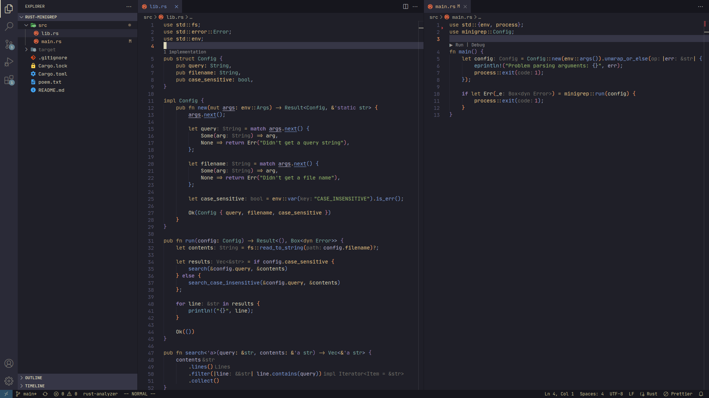
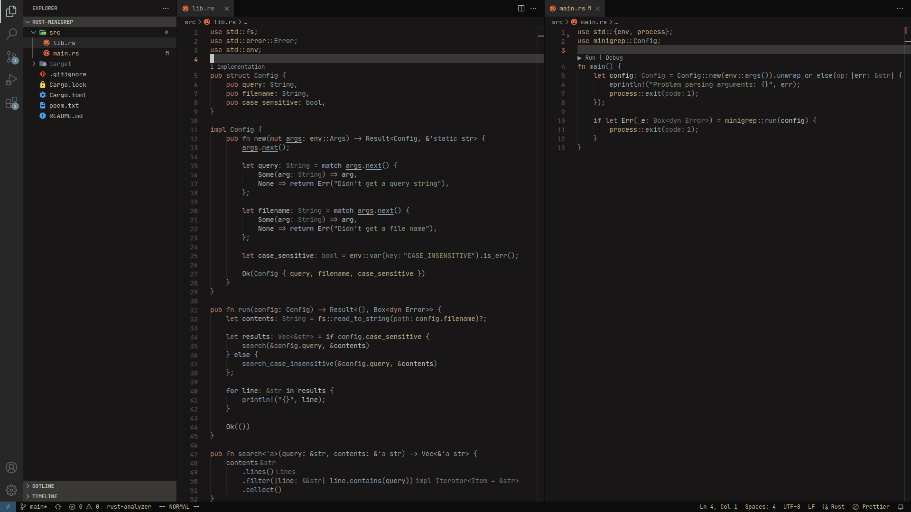
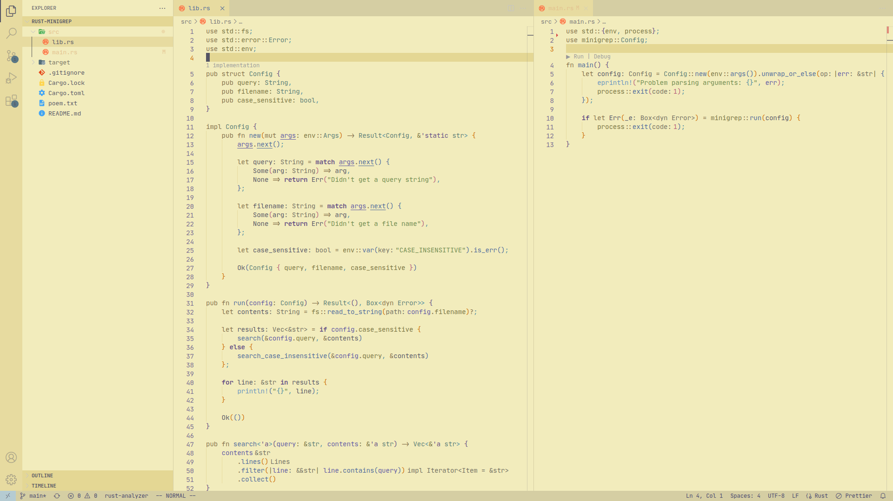

<h2 align="center">Kanagawa Visual Studio Code Color Theme</h2>

  

A port of the beautiful Kanagawa Neovim color theme, including all three flavors `Wave`, `Dragon` and `Lotus`.

  <h3>Wave</h3>
  

  <h3>Dragon</h3>
  

  <h3>Lotus</h3>
  

Credits to [rebelot](https://github.com/rebelot/kanagawa.nvim) for the original Neovim theme and [barklan](https://github.com/barklan/kanagawa.vscode) for the VS Code template.

## License

This project is licensed under the MIT License - see the [LICENSE](LICENSE) file for details.
